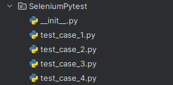

# Automated Testing with Selenium

## Selenium

what is selenium?

Selenium is an open-source suite of tools and libraries that is used for browser automation.

### Selenium Advantages:

1. **Open Source Tool** – Selenium has Free and Open Source tools mostly Used for Web-based Applications There is no need to allot a budget.
2. **Multiple Programming Language** – It has supported multiple programming Languages like Java, Python C#, PHP, Ruby, Perl, and JavaScript.
3. **Continues Integration** – achieve nightly Execution using Jenkins.
4. **Supported Parallel Testing** – Selenium Grid supports parallel execution of Selenium script.
5. **Support Cross Browser Platform**.- It works on almost all popular browsers such as Chrome, Firefox, Internet Explorer, Safari, etc.

### Selenium Disadvantages:

1. **High Beginning Cost** – It is right that selenium is free and does not require licensing, We need to think of a couple of other factors 1st setup and configuration of a Test Framework from scratch takes a lot of time and Wasted time translates to high Initial costs if the requirement is urgent.
2. **Required 3rd Party Tool Binding-** Selenium as a framework is not completed Comprehensive solution to fully automating the testing of web Applications. It requires 3rd party libraries and language.
3. Wrapping these libraries to make it a complete solution for [**end-to-end 	testing**](https://qacraft.com/what-is-end-to-end-testing/) requirements.
4. **Difficulty of managing local Infrastructure** 	– parallel Testing is much possible with the selenium Grid however is it economically feasible to set up and manage additional infrastructure?
5. **Slow test development due to script-based approach** – Creating stable and maintainable tests in Selenium is not easy it requires expert knowledge of popular programming languages.

### Components of Selenium

Selenium Suite has 4 components namely:

1. **Selenium IDE:** [
    Selenium IDE](https://www.browserstack.com/guide/what-is-selenium-ide) is a Chrome and Firefox plugin. The primary use of a Selenium IDE is to record user interactions such as clicks, selections etc in the browser and plays them back as automated tests .
2. **Selenium RC:** Selenium RC was built to automate the testing of web applications by simulating user interactions across different browsers and platforms. It provided a way to browser automation remotely and execute test scripts written in various programming languages.
3. **Selenium WebDriver:** Selenium WebDriver is a powerful and enhanced version of Selenium RC which was developed to overcome the limitations of Selenium RC. WebDriver communicates with browsers directly with the help of browser-specific native methods, thereby completely eliminating the need of Selenium RC.
4. **Selenium Grid:** [
    Selenium Grid](https://www.browserstack.com/guide/selenium-grid-tutorial) is a smart proxy server that allows QAs to run tests in parallel on multiple machines. This is done by routing commands to remote web browser instances, where one server acts as the hub. This hub routes test commands that are in JSON format to multiple registered Grid nodes.

---

## Pytest

Pytest is a popular testing framework for Python. It simplifies writing tests by providing features like automatic test discovery, fixture support, parameterized testing, and many built-in assertions. Pytest is widely used in the Python community due to its simplicity, flexibility, and powerful features.

### Advantages of Pytest

1. Pytest can run multiple tests in parallel, which reduces the execution time of the test suite.
2. Pytest has its own way to detect the test file and test functions automatically, if not mentioned explicitly.
3. Pytest allows us to skip a subset of the tests during execution.
4. Pytest allows us to run a subset of the entire test suite.
5. Pytest is free and open source.
6. Because of its simple syntax, pytest is very easy to start with.

---

## The Project

**1. Introduction**

The project involves automated testing of a web application using Selenium, a widely-used tool for automating web browsers. The web application under test is a movie database system accessible via a local server at http://127.0.0.1:8000/. The testing focuses on various functionalities such as genre filtering, user authentication (signup, login, logout), and movie filtering based on type, language, and country.


**2. Technologies Used**

1. Python: The primary programming language for writing test scripts.
2. Selenium: A tool for automating testings.
3. pytest: A testing framework for running test cases.
4. Chrome WebDriver: WebDriver for controlling Chrome browser.
   

**3. Project Architecture Overview**

The project consists of Python package that consists of four Python files, each containing test scripts for different aspects of the web application.



3.1. File-1: TestGenres

- Fixture Setup: Initializes the WebDriver and opens the web application.

Here we import required libraries in this file

```py
from selenium import webdriver
from selenium.webdriver.common.by import By
import time
import pytest
```

Here is setup function:

```py
@pytest.fixture(scope="class")
def setup(request):
    driver = webdriver.Chrome()
    driver.get("http://127.0.0.1:8000/")
    time.sleep(2)
    driver.maximize_window()
    time.sleep(2)
    driver.implicitly_wait(10)
    # scrolling_down(driver, "slowly")
    # scrolling_up(driver, "slowly")

    def teardown():
        driver.quit()

    request.addfinalizer(teardown)
    request.cls.driver = driver
```

Scrolling Down Function:

```py
def scrolling_down(driver, status=None):
    if status == "slowly":
        scroll_amount = 100
        current_scroll_position = 0
        while current_scroll_position < driver.execute_script("return document.body.scrollHeight"):
            driver.execute_script("window.scrollBy(0, " + str(scroll_amount) + ");")
            current_scroll_position += scroll_amount
            time.sleep(0.1)
    else:
        driver.execute_script("window.scrollTo(0, document.body.scrollHeight);")
    time.sleep(3)
```

This function, `scrolling_down`, scrolls the webpage down to the bottom. Optionally, it can scroll slowly by incrementing the scroll position in small steps, or scroll directly to the bottom if no specific speed is specified. It pauses for 3 seconds after scrolling to allow the content to load.

Scrolling Up Function:

```py
def scrolling_up(driver, status=None):
    if status == "slowly":
        scroll_amount = -100
        scroll_delay = 0.1
        current_scroll_position = driver.execute_script("return document.body.scrollHeight")
        while current_scroll_position > 0:
            driver.execute_script("window.scrollBy(0, " + str(scroll_amount) + ");")
            current_scroll_position += scroll_amount
            time.sleep(scroll_delay)
    else:
        driver.execute_script("window.scrollTo(0, 0);")
    time.sleep(3)
```

This function, `scrolling_up`, scrolls the webpage up to the top. Optionally, it can scroll slowly by decrementing the scroll position in small steps, or scroll directly to the top if no specific speed is specified. It pauses for 3 seconds after scrolling to allow the content to load.

- Test Methods:

  test_all(): Tests the functionality of displaying all genres.

  ```py
  @pytest.mark.usefixtures("setup")
  class TestGenres:
  
      def test_all(self):
          click_navbar_dropdown(self.driver)
          genre_button = self.driver.find_element(By.XPATH, "//a[normalize-space()='All']")
          genre_button.click()
          time.sleep(2)
          scrolling_down(self.driver)
          scrolling_up(self.driver)
          self.driver.back()
          time.sleep(1)
  ```

  - test_documentary(): Tests the functionality of displaying the documentary genre.

    ```py
    def test_documentary(self):
        click_navbar_dropdown(self.driver)
        genre_button = self.driver.find_element(By.XPATH, "//a[@class='dropdown-item'][normalize-space()='Documentary']")
        genre_button.click()
        time.sleep(3)
        scrolling_down(self.driver)
        scrolling_up(self.driver)
        self.driver.back()
        time.sleep(2)
    ```

    - test_adventure(): Tests the functionality of displaying the acventure genre.

      ```py
          def test_action(self):
              click_navbar_dropdown(self.driver)
      
              genre_button = self.driver.find_element(By.XPATH, "//a[@class='dropdown-item'][normalize-space()='Action']")
              genre_button.click()
              time.sleep(1)
      
              scrolling_down(self.driver)
              scrolling_up(self.driver)
      ```

      and so on...

    - test_drama(): Tests the functionality of displaying the drama genre.

    - test_horror(): Tests the functionality of displaying the horror genre.

    - test_romance(): Tests the functionality of displaying the romance genre.

    - test_science_fiction(): Tests the functionality of displaying the science fiction genre.

    - test_fantasy(): Tests the functionality of displaying the fantasy genre.

    - test_historical(): Tests the functionality of displaying the historical genre.

    - test_crime(): Tests the functionality of displaying the crime genre.

    - test_thriller(): Tests the functionality of displaying the thriller genre.

    - test_mystery(): Tests the functionality of displaying the mystery genre.

      